# XY Channel 与 OpenClaw 交互流程

本文系统梳理 `xy_channel` 作为 OpenClaw channel/plugin 时的完整通信机制：外部小艺侧如何进入 OpenClaw，OpenClaw 如何调用模型与工具，channel 如何把中间态、最终结果、设备命令、push 和 subagent 结果送回外部。

## 一句话总览

`xy_channel` 同时承担三类职责：

1. **入站适配器**：把小艺 WebSocket/A2A 消息解析成 OpenClaw 的 channel inbound context。
2. **出站适配器**：把 OpenClaw 的回复、工具状态、文件、命令转换成 A2A `agent_response` 或 push。
3. **外部通信桥**：通过 WebSocket、HTTP push、文件上传服务，把模型与外部设备、对话页、通知页串起来。

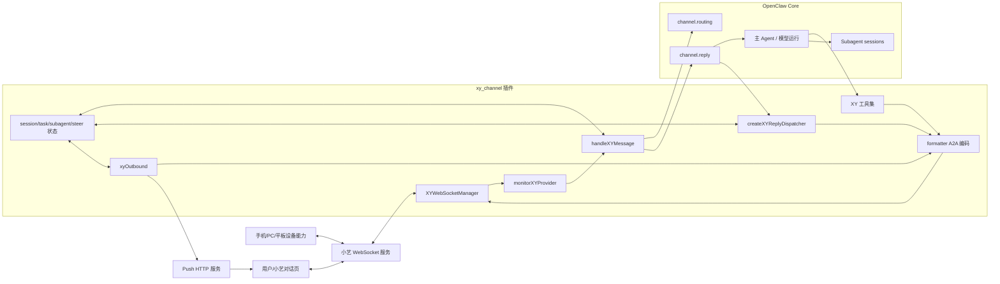

## 核心角色

| 角色 | 代码入口 | 责任 |
| --- | --- | --- |
| Channel plugin | `src/channel.ts` | 注册 `xiaoyi-channel`，声明能力、outbound、agentTools、gateway 启动入口。 |
| WebSocket manager | `src/websocket.ts`, `src/client.ts` | 维护单连接、鉴权初始化、心跳、重连、消息收发、事件拆分。 |
| Monitor | `src/monitor.ts` | 监听 WebSocket 事件，做 session 串行队列、steer 并发分流、特殊事件分发。 |
| Bot dispatcher | `src/bot.ts` | 解析 A2A 请求、注册 task/session、构造 OpenClaw inbound context、启动 reply dispatcher。 |
| Reply dispatcher | `src/reply-dispatcher.ts` | 把 OpenClaw 的流式回复、工具开始/结果、idle/cleanup 映射成 A2A 状态与结果。 |
| Outbound adapter | `src/outbound.ts` | OpenClaw 主动发送文本/媒体时，补齐 A2A task target，并执行 A2A 回写与 push。 |
| Formatter | `src/formatter.ts` | 把 status、artifact、command、clear/cancel 编码成 A2A JSON-RPC `agent_response`。 |
| Tool factory | `src/tools/create-all-tools.ts` | 基于当前 session context 创建设备、跨端、push、文件、图片、agent-as-skill 等工具。 |
| 状态管理 | `src/task-manager.ts`, `src/tools/session-manager.ts`, `src/subagent-wait-state.ts`, `src/steered-completion-state.ts` | 维护 OpenClaw session、A2A task、subagent 等待、steer 完成关系。 |

## 启动与连接生命周期

OpenClaw 加载 channel 后，gateway 通过 `xyPlugin.gateway.startAccount()` 启动小艺侧监听。

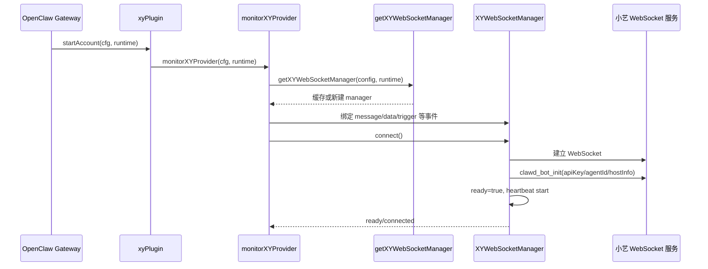

连接层的关键机制：

- `client.ts` 以 `apiKey-agentId` 缓存 `XYWebSocketManager`，避免同一账号重复连接。
- `websocket.ts` 负责心跳、重连、断线缓冲、ready 状态和原始消息拆包。
- `monitor.ts` 只消费 manager emit 出来的结构化事件，不直接解析底层 socket 帧。

## 入站消息处理链路

小艺侧普通对话消息最终会进入 `handleXYMessage()`，然后被转换成 OpenClaw 可以理解的 direct channel 消息。

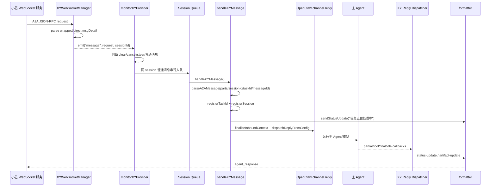

### 入站请求的关键 ID

| 字段 | 来源 | 用途 |
| --- | --- | --- |
| `sessionId` | A2A `params.sessionId` | 小艺会话维度；OpenClaw routing peer id；WebSocket 发送目标。 |
| `taskId` | A2A `params.id` | 小艺任务维度；A2A response 的 `taskId`；并发和 subagent 结果归属依据。 |
| `messageId` | JSON-RPC 顶层 `id` | response 的 JSON-RPC `id`；对话页用它关联一次请求响应。 |
| `sessionKey` | OpenClaw routing | OpenClaw 内部会话上下文；工具上下文、history 和 dispatcher 使用。 |
| `pushId` | A2A data part systemVariables | 用于后续 push 广播；会被持久化。 |

## A2A 响应模型

`xy_channel` 对外主要发送 `msgType: "agent_response"`，其中 `msgDetail` 是 JSON-RPC 字符串。

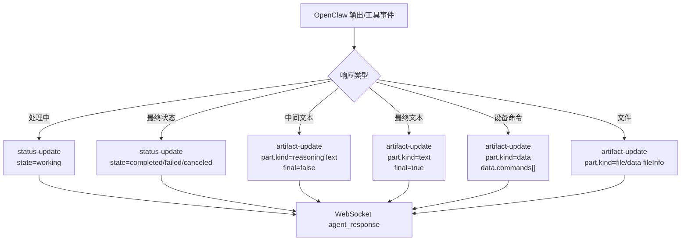

常见发送函数：

| 函数 | A2A kind | 典型使用场景 |
| --- | --- | --- |
| `sendStatusUpdate()` | `status-update` | 初始处理中、工具执行中、完成、失败、等待 subagent。 |
| `sendReasoningTextUpdate()` | `artifact-update final=false` | partial reply、中间过程、subagent 阶段性结果。 |
| `sendA2AResponse()` | `artifact-update final=true/false` | 最终文本、文件信息、异常结果。 |
| `sendCommand()` | `artifact-update data.commands` | 工具向外部设备下发执行命令。 |
| `sendClearContextResponse()` | clearContext response | 清理上下文请求确认。 |
| `sendTasksCancelResponse()` | tasks/cancel response | 小艺侧 cancel/yield 请求确认。 |

## 普通问答流程

普通问题没有工具、没有 subagent、没有 steer 时，链路最短。

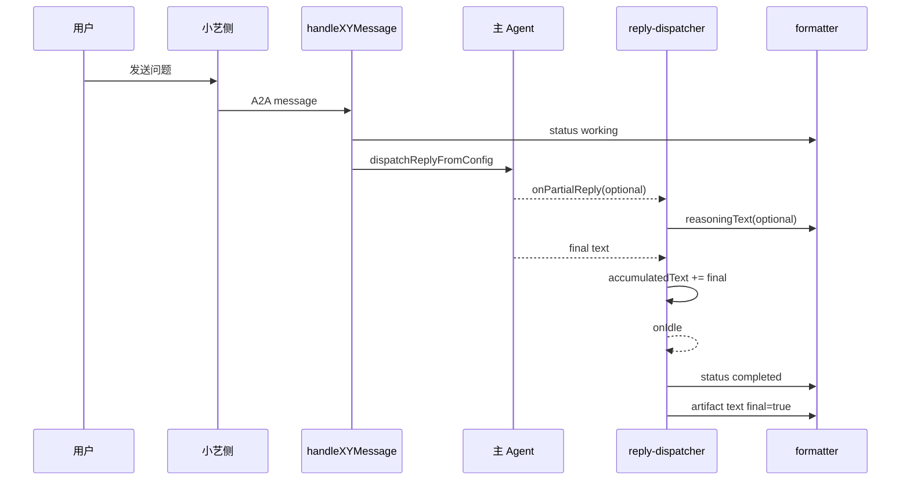

这里有一个重要约束：**真正结束对话页任务的是 final artifact，而不是 status completed 本身**。因此修复任务时要同时检查：

- 是否发送了 `status-update state=completed`
- 是否发送了 `artifact-update final=true`
- 两者的 `sessionId/taskId/messageId` 是否仍然属于同一个原始任务

## 工具与外部设备通信

工具调用是 channel 与外部通信最复杂的部分。OpenClaw 只知道“调用了一个工具”，真正向设备发命令、监听设备返回的是 `xy_channel` 工具实现。

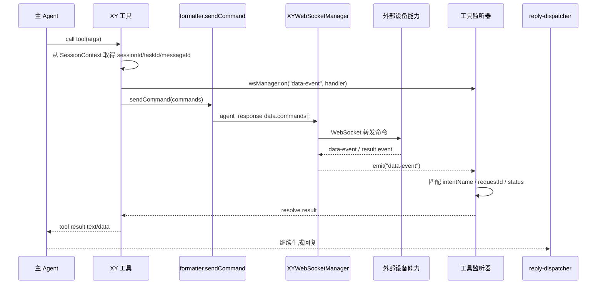

工具上下文的来源：

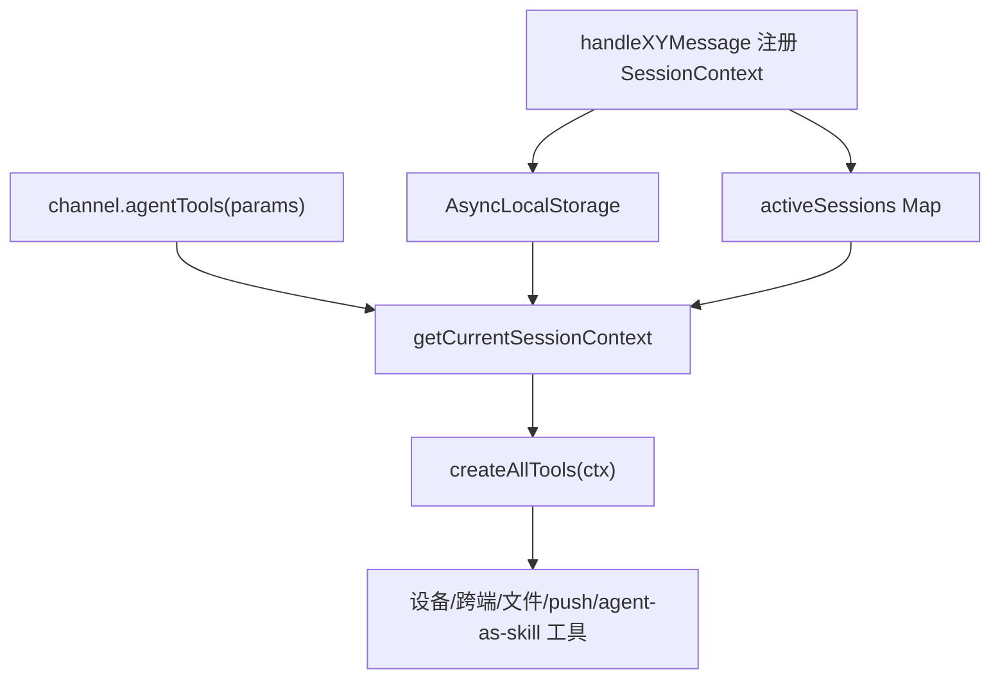

设计要点：

- 首选 `AsyncLocalStorage`，保证并发 session 的工具上下文隔离。
- OpenClaw 嵌入式 runner 边界可能丢失 ALS，因此有 `activeSessions` 和 last registered sessionKey 兜底。
- 工具创建时闭包捕获 `SessionContext`，后续工具执行不应再猜 session。
- cron/scheduled task 没有 WebSocket 前台会话时，会创建 synthetic cron context，命令通过 push 触达设备。

## Outbound 与 Push 机制

OpenClaw 主动对 channel 发送文本时，会进入 `xyOutbound.sendText()`。它同时做两件事：

1. 如果能定位到 A2A task，就先回写对话页。
2. 无论是否回写 A2A，都保存 pushData 并向已知 pushId 广播 push。

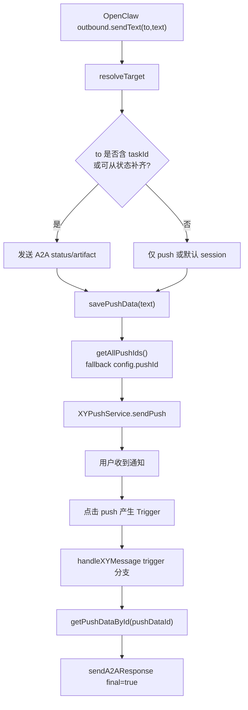

Push payload 中可能包含：

- `pushText`：通知标题。
- `sessionId`：点击后回到哪个会话。
- `pushDataId`：正文内容只存本地，push 里只带引用；点击后通过 Trigger 取回详情。

这个设计让 push 通知可以轻量展示，同时避免把长文本直接塞进通知 payload。

## Subagent / A2A 等待机制

OpenClaw 主 agent 调用 subagent 时，不能把第一个 subagent 结果当作整个任务完成。主 agent 可能还要等待多个 subagent，并对结果进行汇总、二次分析、生成最终答复。

当前 channel 侧通过 `subagent-wait-state` 维护“原始 A2A task 正在等待 subagent”的状态。

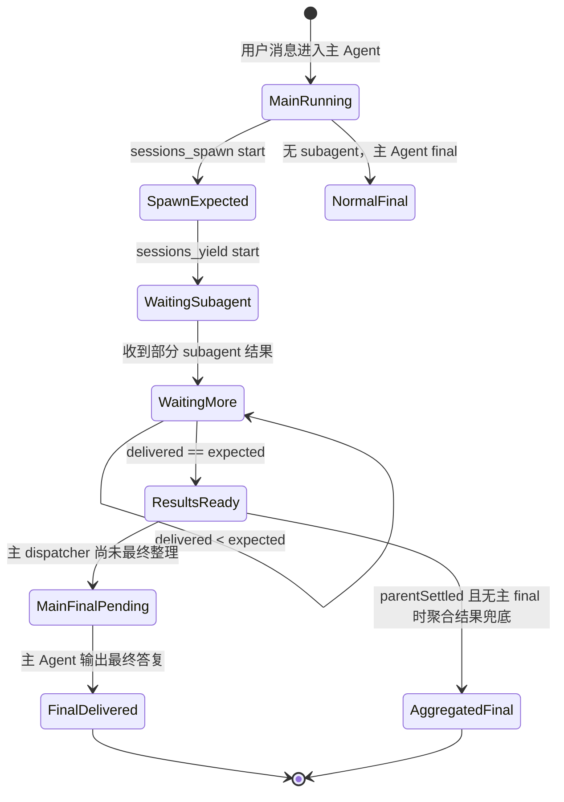

关键规则：

- `sessions_spawn` 开始时增加 `expectedCompletions`。
- `sessions_yield` 只有在前面发生过 `sessions_spawn` 时才进入 wait；单独 yield 不会让任务无限等待。
- subagent 结果到达时，`xyOutbound.sendText()` 先把结果作为 `reasoningText/status` 回写原始 A2A task，并继续 push。
- 只有 `deliveredCompletions >= expectedCompletions` 且主 dispatcher 已 `parentSettled` 时，才允许兜底关闭原始任务。
- 如果 subagent 都完成后主 agent 又输出最终总结，则这条输出会作为真正 final 回写原始 A2A task。

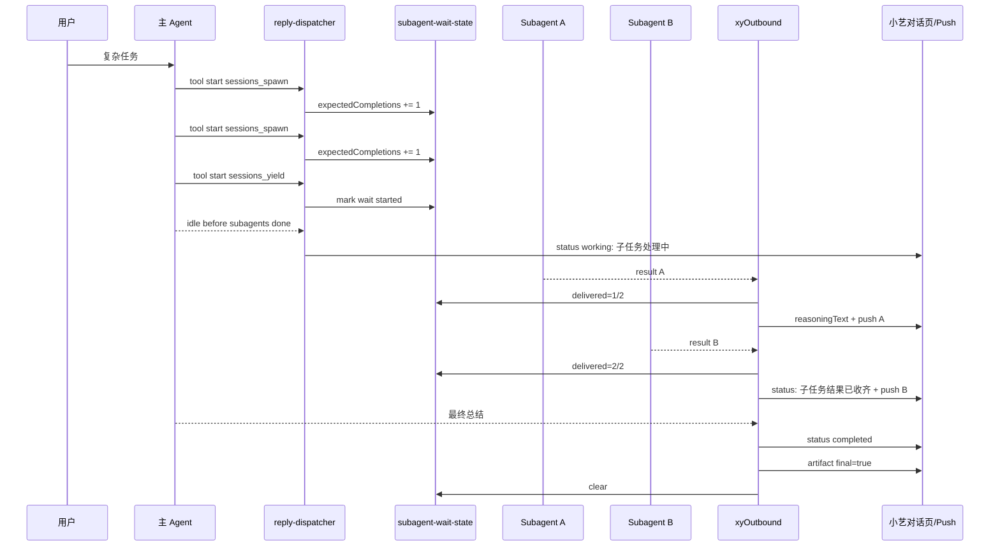

## Steer / 多消息并发机制

同一 session 中用户连续发消息时，不一定都应该排队等待。只有当前 session 确实存在“正在模型流式运行”的任务时，后续消息才作为 steer 注入当前运行。

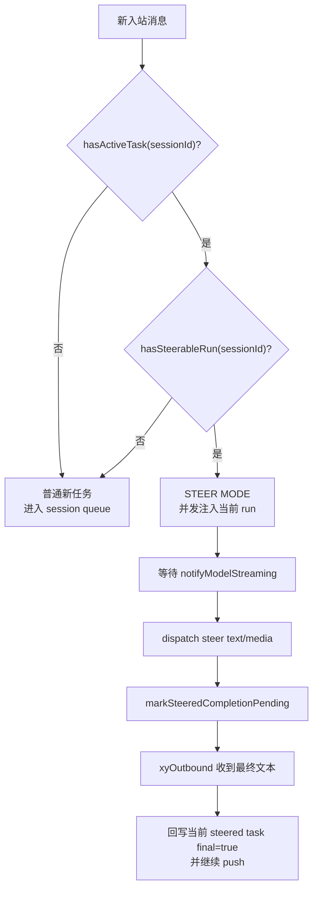

为什么需要双条件：

- 只有 `hasActiveTask` 不够。旧任务可能还残留 task binding，但模型 run 已经结束，此时 steer 会报 `no active run to steer in this session`。
- `hasSteerableRun` 来自 streaming signal，只在真实模型流式阶段存在，因此可以区分“可 steer 的正在运行任务”和“只是未清理完的 task 状态”。

## 特殊消息与外部事件

WebSocket manager 会把不同外部消息归一成事件，monitor 再分发。

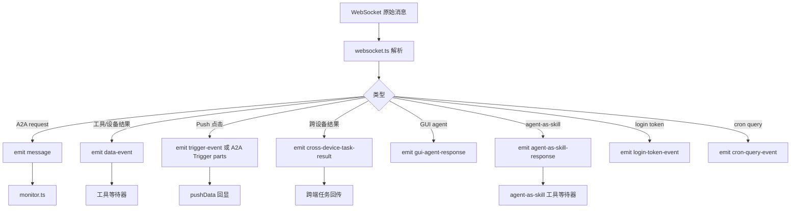

## Session、Task 与状态边界

这部分是排查“没返回结果”“返回到旧任务”“push 点击取不到内容”的关键。

| 状态 | Owner | Key | 生命周期 | 典型问题 |
| --- | --- | --- | --- | --- |
| OpenClaw session context | `session-manager.ts` | `sessionKey` | 消息开始注册，正常结束/错误/最终结果后注销 | ALS 丢失、并发时工具拿错 session。 |
| A2A active task stack | `task-manager.ts` | `sessionId -> taskId[]` | 入站注册，任务完成或取消后按 taskId 移除 | 多任务并发时最新 task 覆盖旧 task。 |
| Subagent wait state | `subagent-wait-state.ts` | `sessionId::taskId` | `sessions_spawn/yield` 建立，最终结果或聚合兜底后清理 | 子任务完成但原始 task 不结束，或第一个 subagent 提前结束整个任务。 |
| Steered completion state | `steered-completion-state.ts` | `sessionId::taskId` | steer dispatch 后建立，steered final 回写后清理 | steer final 只 push 不回对话页。 |
| Push data | `pushdata-manager.ts` | `pushDataId` | outbound text 保存，Trigger 点击读取 | push 能到，但点击后没有正文。 |
| Push ID | `pushid-manager.ts`, `config-manager.ts` | `pushId` | 从用户消息 data part 抽取并持久化 | push 发到旧设备或没有设备。 |

## 清理与终止规则

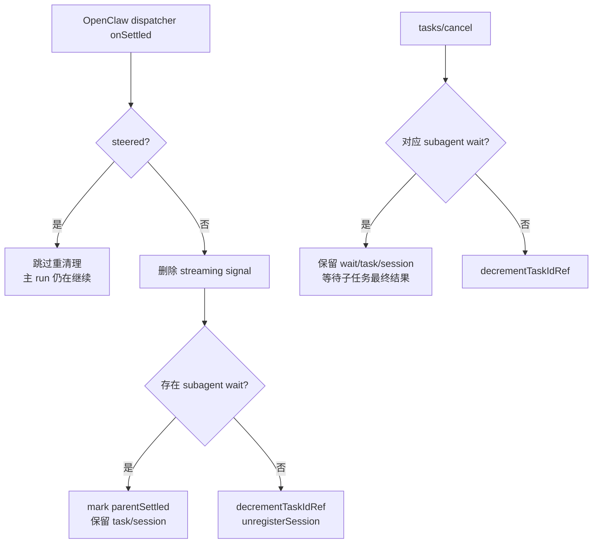

清理原则：

- 普通任务结束：清 `streaming signal`、task binding、session context。
- subagent 等待中：不能清原始 task/session，否则 subagent 最终结果无法回写原始 A2A task。
- steer dispatch settled：不代表主 run 结束，不能误删主任务状态。
- `tasks/cancel` 在小艺侧可能表示前台 yield/cancel 确认，不一定代表 subagent 结果不需要了。

## 端到端通信路径速查

| 场景 | 入站路径 | 出站路径 | 是否 push |
| --- | --- | --- | --- |
| 用户普通提问 | WS `message` -> monitor -> bot -> OpenClaw | dispatcher -> formatter -> WS `agent_response` | OpenClaw 主动 outbound 时会 push；普通 dispatcher final 默认走 A2A。 |
| 工具查设备数据 | Agent -> tool -> `sendCommand` | 设备结果通过 `data-event` 回工具，最终由 Agent 回答 | 取决于最终是否走 outbound。 |
| 发送文件 | OpenClaw media/outbound 或工具 | 文件上传服务 -> A2A file/data artifact | 通常可伴随 push。 |
| 定时/cron 工具 | synthetic cron session | command via push directives，设备再通过 WS 回结果 | 是，主要靠 push 唤起。 |
| 点击 push | Trigger data -> bot trigger 分支 | `getPushDataById` -> A2A final response | push 已发生；点击后是 A2A 回显。 |
| 多条连续消息 | monitor 判断 active+streaming | 可 steer 时并发注入；否则排队新任务 | steered final 也会 push。 |
| 多 subagent | sessions_spawn/yield -> wait state | 每个 subagent 结果先状态/中间回写 + push，主 final 最终关闭 | 每个 subagent 结果都 push。 |

## 排障看日志的顺序

遇到“对话页没有最终结果”时，建议按下面顺序查：

1. 入站是否注册了正确 `sessionId/taskId/messageId`：
   - `[BOT] Resolved route`
   - `[TASK_MANAGER] Registered/Updating taskId`
   - `[BOT] Sending initial status update`

2. 是否误入 steer 或误排队：
   - `[MONITOR-HANDLER] STEER MODE`
   - `[BOT] STEER MODE`
   - `[STEER-QUEUE]`

3. dispatcher 是否进入 subagent wait：
   - `[TOOL-START] sessions_spawn`
   - `[SUBAGENT-WAIT] Expected subagent completions`
   - `[TOOL-START] sessions_yield`
   - `[ON-IDLE] Waiting for subagent completion`

4. subagent 结果是否回到原始 task：
   - `[xyOutbound.resolveTarget] Enhanced target from subagent wait state`
   - `[SUBAGENT-WAIT] Completion delivered count=x/y`
   - `[xyOutbound.sendText] Subagent completion update delivered`

5. 最终是否真的关闭 A2A task：
   - `[A2A_STATUS] Sending status-update`
   - `[A2A_RESPONSE] Sending artifact-update, final=true`
   - `[SUBAGENT-WAIT] Cleared wait state`
   - `[TASK_MANAGER] Removed/Removing taskId`

6. push 点击无内容时：
   - `[xyOutbound.sendText] Push data saved with ID`
   - `[PUSH] Push message sent successfully`
   - `[BOT] Detected Trigger message`
   - `[BOT] Found pushData`

## 设计边界总结

`xy_channel` 与 OpenClaw 的边界可以理解为：

- **OpenClaw 负责智能体运行**：路由、模型、工具调用调度、subagent 调度、reply lifecycle。
- **xy_channel 负责协议落地**：A2A JSON-RPC 编码、WebSocket/push/file upload、外部设备命令与回调监听。
- **状态桥负责把两边对齐**：`sessionKey` 对齐 OpenClaw 会话，`sessionId/taskId/messageId` 对齐小艺 A2A 任务，subagent/steer 状态保证异步结果不丢、不串、不提前结束。

只要排查时始终同时看这三组 ID：

```text
OpenClaw: sessionKey
小艺会话: sessionId
小艺任务: taskId + messageId
```

大多数“没有返回结果”“返回到旧任务”“push 点击无结果”“连续消息报 no active run”问题，都能定位到是哪一层状态没有正确建立、更新或清理。
